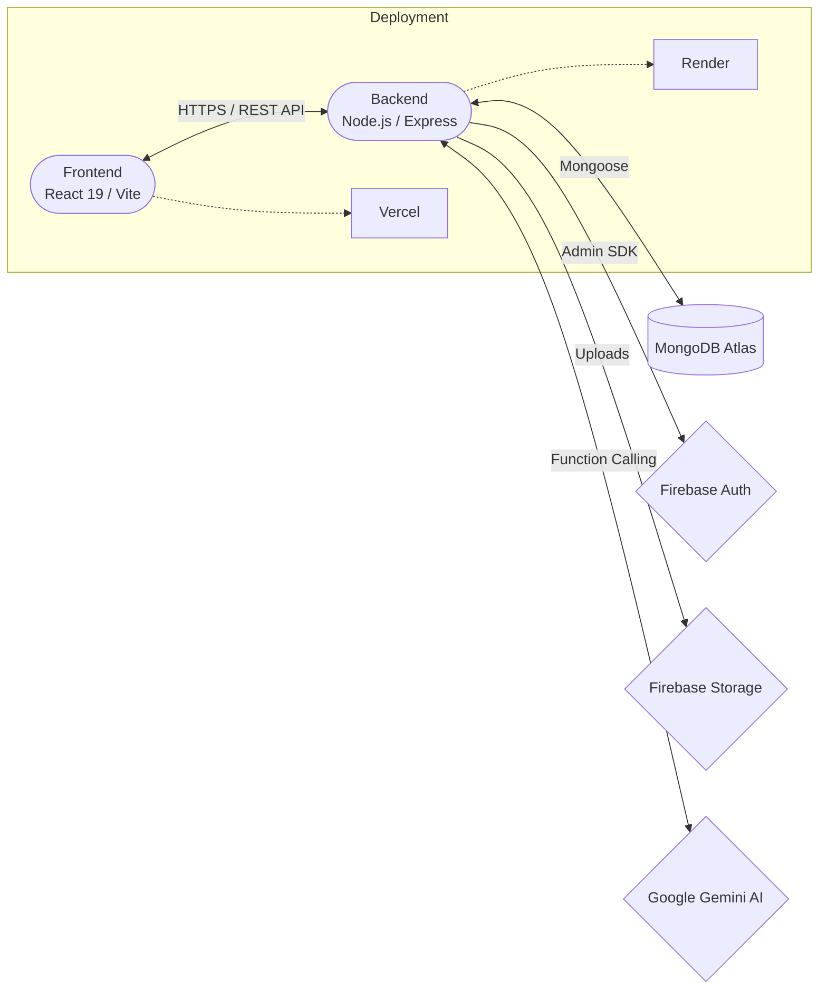
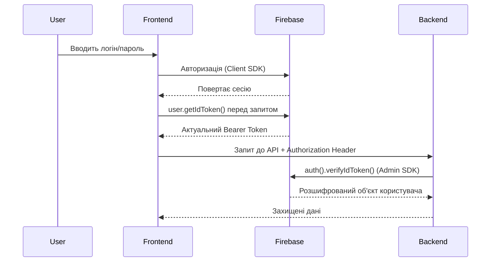
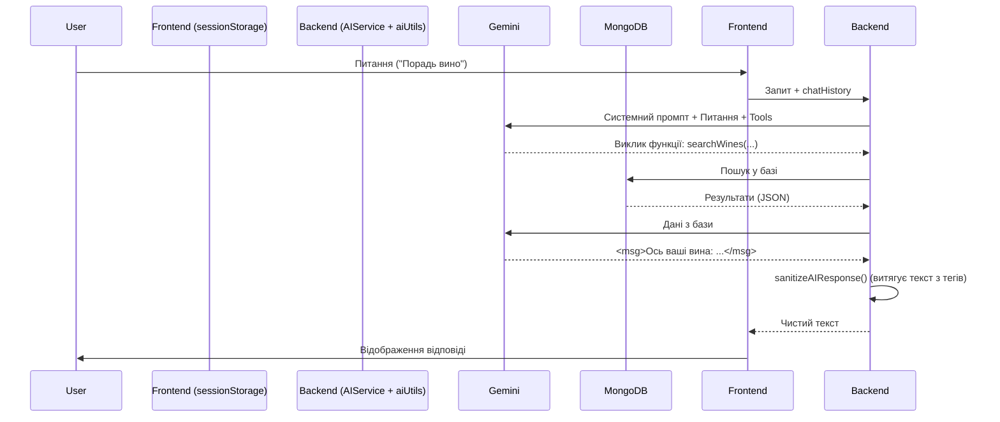
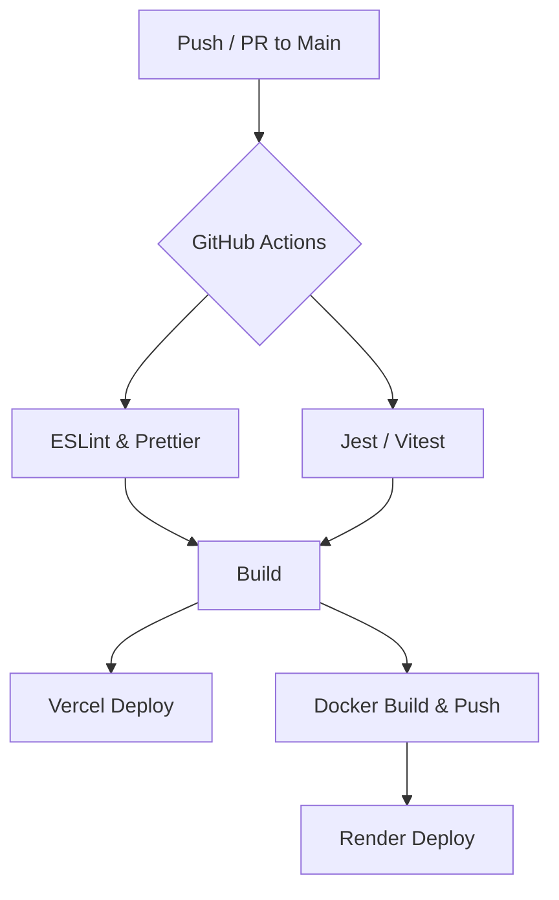

# Архітектура проєкту

Документ описує загальну архітектуру Wine Project та ключові технічні рішення.

---

## Огляд архітектури

Wine Project побудований за архітектурою **клієнт-сервер**. Система спроєктована з урахуванням модульності та масштабованості.



---

## Frontend

### Технології
| Технологія | Призначення |
|------------|-------------|
| **React 19** | UI-фреймворк |
| **Vite** | Збірка та dev-сервер |
| **TypeScript** | Типізація |
| **React Router** | Маршрутизація |
| **TanStack Query** | Серверний стейт, кешування, синхронізація |
| **Zustand** | Клієнтський UI-стейт (фільтри, авторизація) |
| **React Hook Form** | Керування формами та валідація |
| **Zod** | Схеми валідації даних |
| **styled-components** | Стилізація |
| **Firebase SDK** | Автентифікація |
| **Axios** | HTTP-клієнт з кешуванням токенів |
| **Leaflet** | Мапи |
| **Tiptap** | Rich Text Editor |

### Структура
```text
frontend/src/
├── api/              # API-клієнти (Axios інстанс та ендпоінти)
├── components/       # React-компоненти
│   ├── common/       # Перевикористовувані (Skeleton, FormField тощо)
│   ├── forms/        # Форми на базі React Hook Form
│   ├── layout/       # Шаблон (Header, Footer)
│   └── .../          # Доменні компоненти (Wine, Winery, Tour)
├── constants/        # Константи, Query Keys, дані мапи
├── hooks/            # Кастомні хуки
├── pages/            # Сторінки додатку
├── store/            # Zustand сторі (Client-side state)
├── types/            # TypeScript типи (уніфіковані, DRY)
└── utils/            # Утиліти (форматування, обробка помилок)
```

---

## Backend

### Технології
| Технологія | Призначення |
|------------|-------------|
| **Node.js** | Runtime |
| **Express** | HTTP-сервер |
| **TypeScript** | Типізація |
| **Mongoose** | ODM для MongoDB |
| **Firebase Admin** | Серверна автентифікація |
| **Joi** | Валідація |
| **Helmet** | Безпечні заголовки |
| **express-rate-limit** | Rate limiting |
| **Swagger** | API-документація |
| **Google Gemini AI** | AI-помічник |
| **sanitize-html** | Очищення HTML (XSS захист) |

### Структура
Бекенд використовує **Service Repository Pattern**, де контролери відповідають лише за HTTP-відповіді, а бізнес-логіка винесена у сервіси у вигляді чистих асинхронних функцій.

```text
backend/src/
├── config/           # Swagger та AI конфіг
├── controllers/      # Обробники HTTP запитів
├── data/             # Сид-дані
├── middleware/       # Авторизація, завантаження файлів (Multer)
├── models/           # Mongoose моделі
├── routes/           # Маршрути (Express Router)
├── schemas/          # Joi-схеми
├── services/         # Бізнес-логіка (Функціональний підхід)
└── index.ts          # Точка входу
```

---

## Потік даних

### Автентифікація (Firebase + Custom JWT logic)
Процес авторизації побудований на перехопленні запитів (Interceptors) для гарантії актуальності токена без необхідності зберігати його в LocalStorage.



---

## AI-помічник (Сомельє)

### Архітектура та компоненти
AI-Сомельє побудований на базі **Google Gemini SDK** з використанням технології **Function Calling**. Модель має доступ до інструментів бази даних, що гарантує достовірність рекомендацій.

Ключові компоненти:
- **`aiConfig.ts`**: Централізоване керування системними промптами, параметрами моделі (temperature, tokens) та іконками.
- **`aiService.ts`**: Логіка взаємодії з Gemini, оркестрація викликів функцій (Function Calling) та підтримка історії діалогу.
- **`aiUtils.ts`**: Спеціалізовані утиліти для очищення (sanitization) відповідей ШІ від технічних роздумів та планів.

### Механізм чистої відповіді
Для виключення "технічного сміття" (Chain of Thought) з відповідей користувачу, впроваджено систему тегів:
1. ШІ зобов'язаний обгортати фінальну відповідь у теги `<msg>...</msg>`.
2. Бекенд-утиліта витягує лише вміст цих тегів, ігноруючи будь-який текст зовні.
3. Температура моделі встановлена на рівні `0.1` для максимальної точності та дотримання формату.

### Пам'ять та сесії
- **Frontend**: Історія чату зберігається в `sessionStorage` (останні 20 повідомлень). Дані автоматично очищуються при закритті вкладки або браузера.
- **Backend**: Модель отримує `chatHistory` у кожному запиті для підтримки контексту розмови.



---

## Безпека

### Захист на бекенді
| Механізм | Опис |
|----------|------|
| **Helmet** | HTTP-заголовки безпеки (Content-Security-Policy тощо) |
| **CORS** | Динамічний білий список дозволених доменів |
| **Rate Limiting** | 1000 запитів/15 хв (захист від DDoS) |
| **Input Validation** | Joi schemas + Mongoose validation |
| **HTML Sanitization** | Очищення описів вин/вінерій від XSS скриптів |

### Рольова модель (RBAC)
| Роль | Права |
|------|-------|
| `USER` | Читання, створення відгуків, додавання в улюблені |
| `WINERY_OWNER` | + Створення та управління власною виноробнею, винами, турами |
| `ADMIN` | + Видалення користувачів, видалення будь-яких відгуків, надання VIP-статусу |

---

## CI/CD

### Потік розгортання

